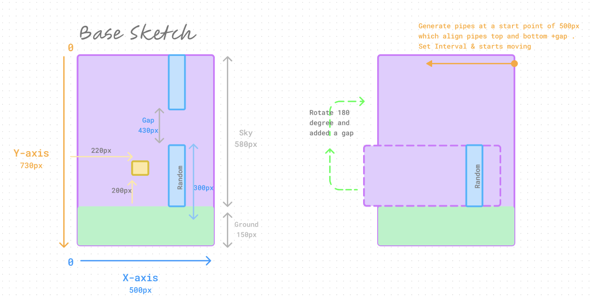
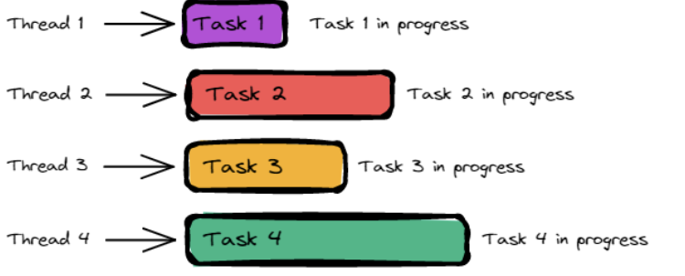
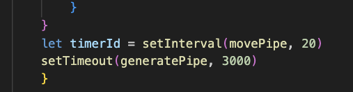
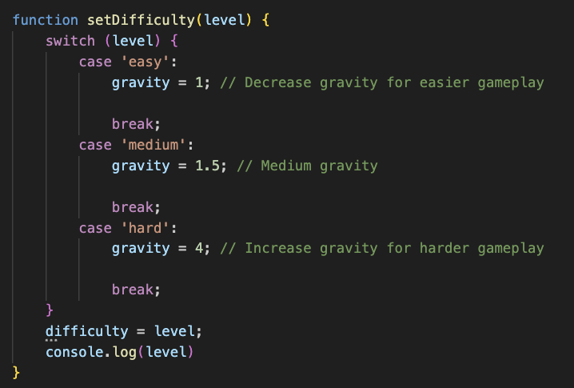
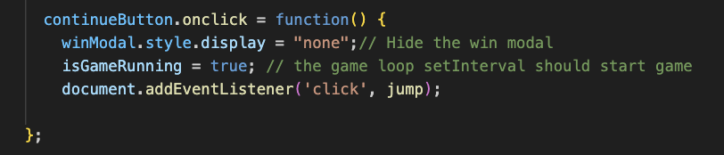

# Developing a Flappy Bird (Fish)

---

### Game Decription

---

"A simple game about a fish that swims through obstacles and for each obstacle that it passes, it's awarded a +1 point.
When you tap, the object of control goes up, when you don't do anything – it falls to the ground due to the gravity.  Test your limits, beat your high score and earn your bragging rights among your friends!"

Flappy Fish is my own spin off from the original mobile game, Flappy Bird, which took the world by storm back in 2013.

Fun Fact - It only took Mr Dong Nguyen, creator of Flappy Bird, 3 days to create the game from start to end. Spoiler Alert: Even adding a special appearance of Mario from the world famous Nintendo game, Super Mario, as the end game Boss at level 999.

I added a twist to the game where you get to choose the difficulty levels. There are 3 levels of difficulty for you to choose from, Easy, Medium, Hard.

### How to play

---

- Select difficulty level and start the game.
- Once you press start, fish will be sinking automatically.
- Press ‘spacebar’ or ‘left click’ to keep fish alive.
- Avoid any form of collision. Touching the green pipes and top or bottom of the screen means gameover!
- After getting a hang of swimming your fish, aim to pass through the pipes and earn points.
- Pass through 5 rounds consecutively to win.

### Approaches to creating game

---

- [x] Flappy Bird Process

      Write start game logic
      Making bird jump
      Hooking up command keys
      Generate a pipe
      Generate new obstacles using setInterval() and setTimeout()
      How to add images to project
      Write gameover logic
      Rotate pipes 180 degrees
      Expand collision rules using && and ||
      Score points as object passes through
      Highscore record
      Winning Condition Logic
      Replay or Continue
      Difficulty Level

### Sketch

---

During the process of creating the code, there was some confusion with the measurements between the components and object. This led me to draw a sketch to observe how i wanted the game mechanics to be. It helped me to break down different types of variables and functions involved, such as interactive parts, concepts of components and location of object.

### User In-game Experience

---

1. The start page will display three difficulty options to choose from: Easy, Medium, or Hard.

2. Upon selecting a difficulty, the player can start the game by clicking the ‘Start’ button, which will take them to the actual gameplay.
   

3. The fish will start descending immediately once the game begins.

4. The player can press the “spacebar” key or left mouse button to make the fish ‘jump’.

5. The objective is to avoid pipes and the ground in order to survive. Colliding with pipes or the ground will trigger the “Game Over” modal, and the player will have to restart. A message will appear with ‘Game Over’ and a ‘Restart’ button.

6. Clicking the ‘Restart’ button will reload the page back to the Start Page, where the player can choose the difficulty level again and replay the game.

7. If the player manages to pass through 5 pipes consecutively, the win modal will activate with a “Congratulations” message and two buttons: ‘Replay’ and ‘Continue’.
   The ‘Replay’ button will return the player to the Start Page, allowing them to choose the difficulty level again and replay the game.
   The ‘Continue’ button will allow the player to keep playing beyond the initial winning condition of 5 points and aim for a higher score.
   

### Callbacks

---

Asynchronous Programming
Allows us to handle multiple tasks simultaneously rather than executing them one after the other.

For example, setTimeout method is used to execute the callback after a specified time (in this case, 3 seconds). The callback will be executed asynchronously, which means that the program will continue to execute the next line of code without waiting for the timeout to complete.

The setInterval() - used to call a function repeatedly at a specified interval of time. Commonly used to create animations or to update parts of a program regularly.
The setTimeout() - used to call a function after a certain period of time.

SetInterval() is cancelled by clearInterval() method.
SetTimeout() is cancelled by clearTimeout() method

A timer (setInterval()) is set to call the movePipe() function every 20 milliseconds, effectively animating the movement of the pipes.
Meanwhile, a timeout (setTimeout()) is set to call the generatePipe() function after 3000 milliseconds (3 seconds), to generate new pipes at intervals during the game.

This approach is essential for building responsive and interactive applications, especially those that involve real-time interactions and dynamic content."

### Difficulty Levels

---

Introduce difficulty levels to game with easy, medium, and hard buttons, Adjustments can be made to gravity, pipe speed, or the gap between pipes based on the selected difficulty level. In this case, i chose gravity as the variation.

### Continue Option

---

An option to continue the game after a win was implemented by adding a 'Continue' button to the win modal. When the player clicks on this button, the win modal is hidden, and the game resumes from where it left off.

However, a glitch emerged where multiple pipes began appearing indefinitely, causing the game to enter an infinite loop. Using a flag (isGameRunning = true) helped to halt this loop and if (!isGameRunning) return; restore control to other functions."

### Key Takeaways

---

Throughout the project, I learned how to understand and study how others recreated this game. There were different methods to make the game work, so it's important to find a style that suits me best. I found that I learned the fastest by recreating and modeling someone else's work.

I love how setInterval() and setTimeout() animate the game. They are the magic and core of how the game comes together. This approach allows the game to perform multiple tasks concurrently, such as rendering animations, handling user input, and updating game state based on timed events, without blocking the main execution thread. It is essential for building responsive and interactive applications, especially those that involve real-time interactions and dynamic content.

Although design might not be the primary focus of our project, however i do find myself spending extra time on it. I had alot of fun using modals as a pop up. They ensure a clean and functional user interface to enhance user experience. Plus, modals typically have a basic design that doesn't require extensive customization and they look prettier than event listener buttons.

### Future Developments

---

Here’s some future ideas that can be integrated:

- Change of characters can be unlocked as player progress in the levels or difficulty.
  (Smaller fish, bigger fish, different species of sea creatures)
- Limited edition or seasonal background collection.
- Difficulty Modes such as having more pipes, smaller gaps between pipes, reverse direction of fish and pipes, different shape forms of obstacles.
- Multiplayer

### List of Technology Used

---

- HTML
- CSS
- JavaScript
- Git and Github

### Deployment

---

You may try out the game by clicking the following link!

https://flappy-fish.vercel.app

### References

---

https://developer.mozilla.org/en-US/docs/Web/HTML/Element/dialog
https://www.codewithfaraz.com/content/194/step-by-step-guide-develop-flappy-bird-game-using-html-css-and-javascript-source-code
https://github.com/kubowania/flappy-bird/blob/master/README.md
https://www.educative.io/courses/game-development-js-tetris/collision-detection
